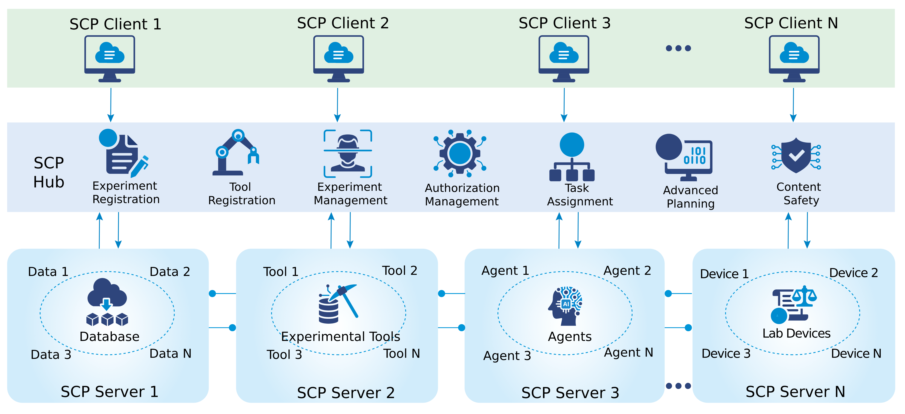
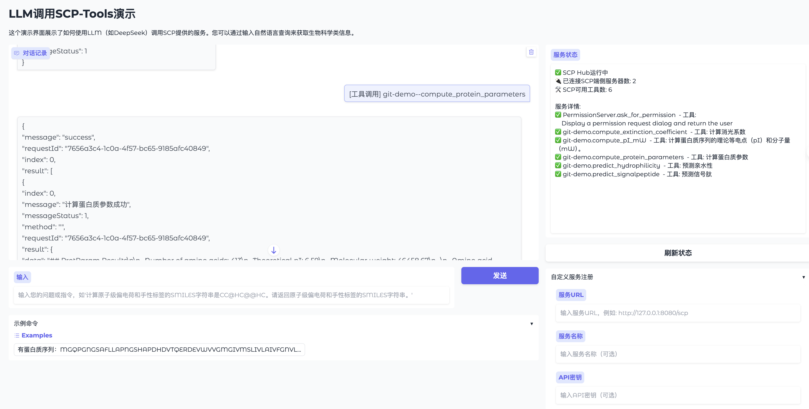

# Scientific Intelligence Context Protocol (SCP) 
*科学智能上下文协议* [[中文版]](https://github.com/open-sciencelab/scp/blob/main/README_CN.md)

## 📖 Table of Contents
- [Introduction](#introduction)
- [Why SCP](#why-scp)
- [Protocol Scope & Focus](#protocol-scope--focus)
- [Key Advantages](#key-advantages)
- [Key Applications](#key-applications)
- [Framework Design](#framework-design)
- [Core Components](#core-components)
- [Installation](#installation)
- [Quick Start](#quick-start)
- [Examples](#examples)

## 📄 Introduction

The Scientific Intelligence Context Protocol (SCP) is an open-source standard independently developed by Shanghai AI Laboratory and specifically designed to accelerate scientific discovery. By establishing a standardized connectivity framework, it enables efficient interaction between discovery-oriented applications and external research assets—such as laboratory instruments, databases, knowledge repositories, large language models (LLMs), specialized computational models, tools, and APIs. Inspired by the universality and ease of use of the Model Context Protocol (MCP), SCP provides a consistent yet flexible interface for integrating wet-lab equipment, data stores, knowledge bases, LLMs, domain-specific simulation models, and other research components. In doing so, SCP aims to foster a hybrid dry-wet, multi-institution collaborative research paradigm and serve as a novel support platform to enable the collaborative evolution of researchers, research tools, and research subjects in a new era of multi-agent-driven scientific investigation and discovery.

### Key Capabilities

1. **Breaking Data & Capability Silos**
   - Unified interface and federated SCP Servers
   - Seamless sharing of datasets, models, agents, and lab equipment
   - Trivially composable dry-wet hybrid experiments across institutions

2. **End-to-End, One-Stop Scientific Workflows**
   - Uniform identifiers for data, results, and process memories
   - Chain intermediate outputs and results across experimental phases
   - Ensure full reproducibility and traceability

3. **Secured, Multi-Discipline Collaboration**
   - Per-experiment access control policies enforced by SCP Hub
   - Scoped permissions and priority levels for researchers, data objects, models, and resources
   - Safeguard confidentiality and ensure fair resource allocation

## 🔍 Why SCP

Current Model Context Protocols (MCP) and Agent-to-Agent (A2A) interaction standards face three core challenges in multi-disciplinary, hybrid scientific experiments:

1. **Data-Agent Silos**
   - Poor interoperability between experimental datasets, AI models, and wet-lab devices

2. **Workflow Fragmentation**
   - Lack of unified context/memory between experimental stages
   - Results in repeated setup overhead and errors

3. **Limited Security & Control**
   - Difficulty enforcing fine-grained permissions in multi-disciplinary collaborations

## 🚀 Protocol Scope & Focus

- **Standardized Connectivity**: Providing uniform interfaces for interactions among research instruments, tools, models, and data within scientific workflows, substantially reducing the complexity of custom integrations and thereby greatly improving research efficiency.
- **Context Awareness**: Through its standardized design, the protocol enables discovery applications to better understand and leverage contextual information (data, models, agents, experimental tools, and equipment), facilitating the development of more intelligent and adaptive AI solutions.
- **Dry-Wet Integration**: Supporting seamless connection with wet-lab apparatus to automate the end-to-end process from theoretical hypothesis to experimental validation, accelerating the pace of scientific investigation.
- **Multi-Agent Collaboration**: Promoting coordinated operation among diverse agents (e.g., LLMs, automated instrumentation, computational models), fostering a highly efficient, collaborative research ecosystem.
- **Data Services**: "Data as a Service" for processing and constructing AI-ready datasets, enabling frictionless linkage between datasets, models, intelligent agents, and laboratory equipment.

## 🎯 Key Advantages

1. **Universal Interoperability**
   - One protocol fits all scientific instruments, data stores, and AI agents
   - No need for bespoke adapters per device or model
   - Simplified integration across diverse research components

2. **Flexible, Context-Aware Development**
   - Full freedom for application developers to innovate
   - Automatic end-to-end contextual metadata benefits
   - Adaptive orchestration capabilities

3. **Open, Community-Driven Evolution**
   - Released under an open-source license
   - Welcomes worldwide contributions and extensions
   - Addresses emerging experimental needs

4. **Robust Security & Compliance**
   - Built-in authentication and authorization
   - Comprehensive audit trails
   - Trustworthy foundation for high-stakes research

## 🚩 Key Applications

### Protein Engineering
Via SCP, researchers can interface with protein synthesis platforms, purification systems, and functional‐analysis instruments to automate the entire workflow—from in silico design through experimental validation. SCP enables seamless integration of computational models with wet-lab apparatus, accelerating protein optimization and downstream application development.

### Materials Synthesis
SCP facilitates interaction with materials fabrication equipment and performance-testing devices, streamlining the R&D pipeline and speeding up the discovery and deployment of novel materials.

## 🎉 Framework Design
<div align="center">

</div>

### SCP Protocol Architecture
On top of standard MCP, SCP introduces four extensions tailored to scientific workflows:
1. **Rich Experiment Metadata**
  - Defines parameters such as experimenter_id, experiment_id, a brief objective, and URIs for data storage, result archives, and process memory logs.
   ```python
   class BaseParams(TypedDict):
       UUID: str
       user_id: str
       organization_id: str
       experiment_type: Literal["dry", "wet", "hybrid"]
       experiment_name: str
       priority: Literal["high", "med", "low"]
   ```

2. **Centralized SCP Hub**
  - A registry for all experimental services (data stores, compute models, wet-lab devices).
  - Handles service discovery, lifecycle management, experiment memory versioning, and OAuth 2.1-based authentication.

3. **Intelligent Orchestration**
  - Introduces an “Experiment Flow API” layered atop the Agent API.
  - Enables automated composition of AI-driven workflows—recommending optimal protocols, resource allocations, and next-step actions.

4. **Wet-Lab Integration**
  - Standardized device drivers
  - Vendor-agnostic interfaces
  - Composable workflow services

## 🔥 Core Components

### 1. SCP Server

**Key Functions:**
- Access control management: The SCP server manages permissions for itself and its internal tools, supporting dynamic updates to access rights.
- Automatic registration system: The SCP edge server automatically registers with the central server, streamlining external user access.
- Device and tool management: The SCP edge server oversees existing devices and tools, making them readily available for external invocation.
- Task execution and monitoring: Upon receiving instructions from the SCP central server, the SCP edge server executes operations on connected devices, tools, and models, with intermediate and final results returned in real time.
- Real-time health checks: Regularly assesses the health status of edge devices, tools, and models, reporting back to the SCP edge server to guide internal scheduling and decision-making.

**API Examples:**
```python
@device_action("protein_fold")
async def protein_fold(self, params: DeviceParams) -> ActionResult:
    """Execute protein folding simulation."""
    pass
```

### 2. SCP Hub

**Key Functions:**
- Task distribution and tracking: Processes external instructions; the SCP central server determines the execution logic, invokes the appropriate edge server, and streams intermediate and final results back in real time.
- Edge server health monitoring: Periodically monitors the status of deployed edge services and reports back to the SCP edge server to inform internal scheduling decisions.
- Intent recognition and parsing: Parses user inputs to identify and decompose intent, executes the next steps for experimental tasks, or returns user-friendly guidance for unsupported requests.
- Workflow orchestration: Evaluates recognized tasks against user permissions and available resources, returns the top three execution plans, and upon user selection, carries out the chosen workflow.

### 3. SCP Client

**Key Functions:**
- Tool discovery and inventory: Based on user permissions, compile and present the list of all available SCP edge-side tools to the user.
- User-friendly invocation interface: Enable users to perform end-to-end task orchestration as well as invoke individual tools.
- Permission-based access control: Access to resources is granted based on explicit permissions assigned to users, roles, or groups.

### 4. Message Queue

**Key Functions:**
- Device–Hub Decoupling: Enables full decoupling between edge devices and the central hub, allowing dynamic scaling of device-side hardware resources as required.
- Messaging: Facilitates reliable message passing and status monitoring between edge devices and the hub.

### 5. RADIS Server

**Key Functions**
- Result Caching: Caches each intermediate and final result by UUID to reduce overall system invocation overhead.
- Temporary Result Caching: Stores provisional results to minimize internal communication latency.

### 6. Object Storage

**Key Functions**
- Parameter Sharing: Enables data exchange between the central server and edge servers for large data objects that cannot be conveniently passed via function parameters.
- Other Data Sharing: Supports additional data‐sharing mechanisms as required.


## 🛠️ Installation

> Before installing scp, make sure your machine meets the following minimum system requirements:
>
> - CPU >= 2 Core
> - RAM >= 4 GiB

</br>

The easiest way to start the middleware is through [Docker Compose](docker/docker-compose.middleware.yaml). Before running middleware with the following commands, make sure that [Docker](https://docs.docker.com/get-docker/) and [Docker Compose](https://docs.docker.com/compose/install/) are installed on your machine:


```bash
# start middleware
cd scp
cd docker
mv docker-compose.middleware.yaml  docker-compose.yaml
docker compose up -d

# Install from source
git clone https://github.com/shanghai-ai-lab/scp.git
cd scp
pip install .
```


## 🧪 Examples

See the [`examples/`](./examples/) directory for complete working examples

## 🖊️ LLM Tool Invocation
<div align="center">

</div>

## Acknowledgement
The [Model Context Protocol](https://github.com/modelcontextprotocol) provided us with significant inspiration!

Note: To ensure compatibility with the MCP service, some of its code has been reused.


## 🎫 License

This project is licensed under the MIT License - see the [LICENSE] file for details.
