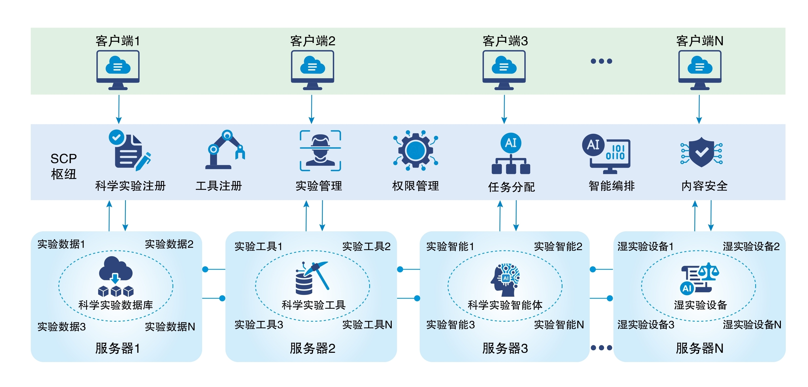

# 科学智能上下文协议
*Scientific Intelligence Context Protocol (SCP)*  [[English Version]](https://github.com/open-sciencelab/scp/blob/main/README.md)

## 📖 目录
- [引言](#引言)
- [为什么需要SCP](#为什么需要scp)
- [协议范围与重点](#协议范围与重点)
- [核心优势](#核心优势)
- [关键应用](#关键应用)
- [框架设计](#框架设计)
- [核心组件](#核心组件-1)
- [安装指南](#安装指南)
- [快速开始](#快速开始)
- [示例](#示例)

## 📄 引言

科学智能上下文协议（SCP）是由上海人工智能实验室独立开发的开源标准，专门用于加速科学发现。通过建立标准化的智能体交互连接框架，它实现了面向发现的应用程序与外部研究资产（如实验室仪器、数据库、知识库、大语言模型（LLM）、专用计算模型、工具和API）之间的高效交互。受模型上下文协议（MCP）的普适性和易用性启发，SCP为整合湿实验室设备、数据存储、知识库、LLM、领域特定模拟模型和其他研究组件提供了一致而灵活的接口。SCP旨在发展人机协同、干湿协同、多域协同的研究范式，并作为新型支持平台，推动研究人员、研究工具和研究对象在多智能体驱动的科学探索新时代中的协同进化。

### 核心能力

1. **打破数据与能力孤岛**
   - 统一接口和联邦式SCP服务器
   - 无缝共享数据集、模型、智能体和实验设备
   - 跨机构轻松组合干湿混合实验

2. **端到端一站式科研工作流**
   - 数据、结果和过程记忆的统一标识符
   - 跨实验阶段链式中介输出和结果
   - 确保完全可复现性和可追溯性

3. **安全的多学科协作**
   - SCP中心节点强制执行按实验的访问控制策略
   - 为研究人员、数据对象、模型和资源设置作用域权限与优先级
   - 保障机密性并确保公平资源分配

## 🔍 为什么需要SCP

当前模型上下文协议（MCP）和智能体间（A2A）交互标准在多学科混合科学实验中面临三大挑战：

1. **数据-智能体孤岛**
   - 实验数据集、AI模型与湿实验室设备间互操作性差

2. **工作流碎片化**
   - 实验阶段间缺乏统一上下文/记忆
   - 导致重复设置开销和错误

3. **有限的安全控制**
   - 多学科协作中难以实施细粒度权限控制

## 🚀 协议范围与重点

- **标准化连接**：为科研工作流中的研究仪器、工具、模型和数据交互提供统一接口，显著降低定制集成复杂度，大幅提升研究效率。
- **上下文感知**：通过标准化设计，使发现应用能更好理解和利用上下文信息（数据、模型、智能体、实验工具和设备），促进开发更智能、自适应的AI解决方案。
- **干湿实验整合**：支持与湿实验室设备的无缝连接，实现从理论假设到实验验证的端到端自动化，加速科研进程。
- **多智能体协作**：促进多样化智能体（如LLM、自动化仪器、计算模型）的协同操作，构建高效协作的研究生态系统。
- **数据服务**：以"数据即服务"模式处理和构建AI就绪数据集，实现数据集、模型、智能体和实验设备的无摩擦连接。

## 🎯 核心优势

1. **通用交互操作性**
   - 单一协议适配所有科学仪器、数据存储和AI智能体
   - 无需为设备或模型定制适配器
   - 简化跨异构研究组件的集成

2. **灵活的上下文感知开发**
   - 为应用开发者提供完全自由的创新空间
   - 自动获取端到端上下文元数据优势
   - 自适应编排能力

3. **开放的社区驱动演进**
   - 基于开源许可发布
   - 欢迎全球贡献和扩展
   - 满足新兴实验需求

4. **强大的安全合规**
   - 内置认证和授权机制
   - 完整审计追踪
   - 为高风险研究提供可信基础

## 🚩 关键应用

### 蛋白质工程
通过SCP，研究人员可连接蛋白质合成平台、纯化系统和功能分析仪器，实现从计算机设计到实验验证的全流程自动化。SCP使计算模型与湿实验室设备无缝集成，加速蛋白质优化和下游应用开发。

### 材料合成
SCP促进与材料制备设备和性能测试装置的交互，简化研发流程，加速新型材料的发现与部署。

## 🎉 框架设计
<div align="center">

</div>

### SCP协议架构
在标准MCP基础上，SCP引入四个针对科研工作流的扩展：
1. **丰富的实验元数据**
   - 定义实验者ID、实验ID、简要目标等参数，以及数据存储、结果归档和过程记忆日志的URI。
   ```python
   class BaseParams(TypedDict):
       UUID: str
       user_id: str
       organization_id: str
       experiment_type: Literal["dry", "wet", "hybrid"]
       experiment_name: str
       priority: Literal["high", "med", "low"]
   ```

2. **中心化SCP枢纽**
   - 所有实验服务（数据存储、计算模型、湿实验室设备）的注册中心
   - 处理服务发现、生命周期管理、实验记忆版本控制和基于OAuth 2.1的认证

3. **智能编排**
   - 在智能体API之上引入"实验流API"层
   - 支持AI驱动工作流的自动组合——推荐最优方案、资源分配和下一步操作

4. **湿实验室集成**
   - 标准化设备驱动
   - 供应商无关接口
   - 可组合的工作流服务

## 🔥 核心组件

### 1. SCP服务器

**核心功能：**
- 访问控制管理：管理自身及内部工具的权限，支持动态更新访问权限
- 自动注册系统：SCP边缘服务器自动向中心服务器注册，简化外部用户访问
- 设备与工具管理：监管现有设备和工具，使其可被外部调用
- 任务执行与监控：接收SCP中心节点指令后，在连接的设备、工具和模型上执行操作，实时返回中介和最终结果
- 实时健康检查：定期评估边缘设备、工具和模型状态，上报至SCP边缘服务器以指导内部调度

**API示例：**
```python
@device_action("protein_fold")
async def protein_fold(self, params: DeviceParams) -> ActionResult:
    """执行蛋白质折叠模拟"""
    pass
```

### 2. SCP枢纽

**核心功能：**
- 任务分发与追踪：处理外部指令，确定执行逻辑，调用对应边缘服务器并实时流式返回结果
- 边缘服务健康监控：定期监测边缘服务状态并反馈至SCP边缘服务器
- 意图识别与解析：解析用户输入以识别和分解意图，执行实验任务或返回用户友好指引
- 工作流编排：根据用户权限和可用资源评估任务，返回前三执行方案，执行用户选定流程

### 3. SCP客户端

**核心功能：**
- 工具发现与清单：基于用户权限编译并展示所有可用SCP边缘工具
- 用户友好调用接口：支持端到端任务编排及独立工具调用
- 基于权限的访问控制：按用户、角色或组分配显式资源访问权限

### 4. 消息队列

**核心功能：**
- 设备-枢纽解耦：实现边缘设备与中心节点的完全解耦，支持按需动态扩展设备端资源
- 消息传递：确保边缘设备与中心节点间可靠的消息传递和状态监控

### 5. RADIS服务器

**核心功能**
- 结果缓存：按UUID缓存所有中介和最终结果，降低系统调用开销
- 临时结果缓存：存储临时结果以减少内部通信延迟

### 6. 对象存储

**核心功能**
- 参数共享：为无法通过函数参数传递的大型数据对象提供中心节点与边缘服务器间的数据交换
- 其他数据共享：按需支持额外数据共享机制

## 🛠️ 安装指南

> 安装scp前请确保设备满足最低系统要求：
>
> - CPU >= 2核
> - 内存 >= 4 GiB

</br>

推荐通过[Docker Compose](docker/docker-compose.middleware.yaml)启动中间件。运行前请确保已安装[Docker](https://docs.docker.com/get-docker/)和[Docker Compose](https://docs.docker.com/compose/install/)：

```bash
# 启动中间件
cd scp
cd docker
mv docker-compose.middleware.yaml  docker-compose.yaml
docker compose up -d

# 源码安装
git clone https://github.com/shanghai-ai-lab/scp.git
cd scp
pip install .
```

## 🧪 示例

完整示例请见[`examples/`](./examples/)目录

## 🖊️ LLM工具调用
<div align="center">

</div>

## 致谢
[模型上下文协议](https://github.com/modelcontextprotocol)给予我们重要启发。

备注：为了兼容MCP服务，复用其部分代码  

## 🎫 许可

本项目采用MIT许可证，详见[LICENSE]文件。
